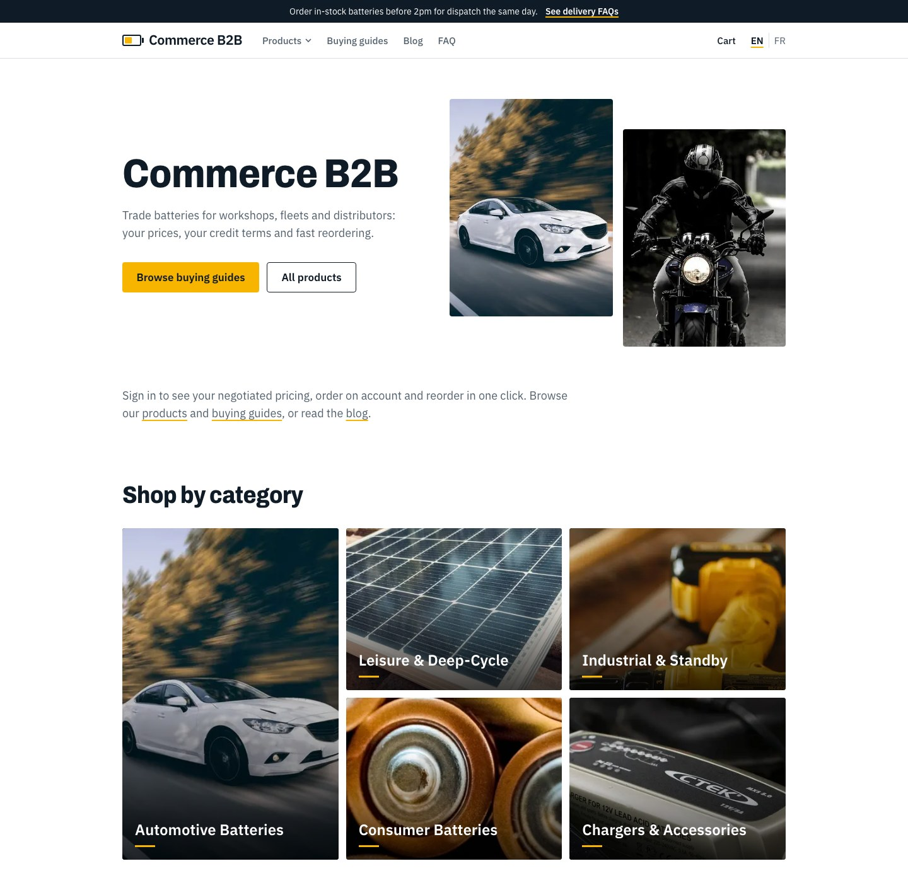
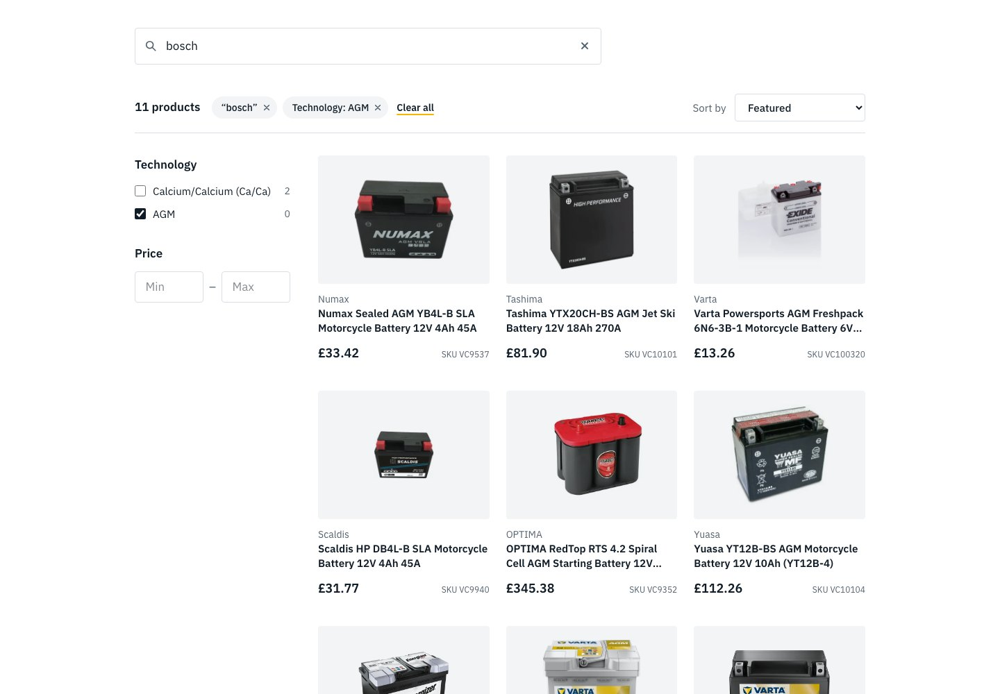
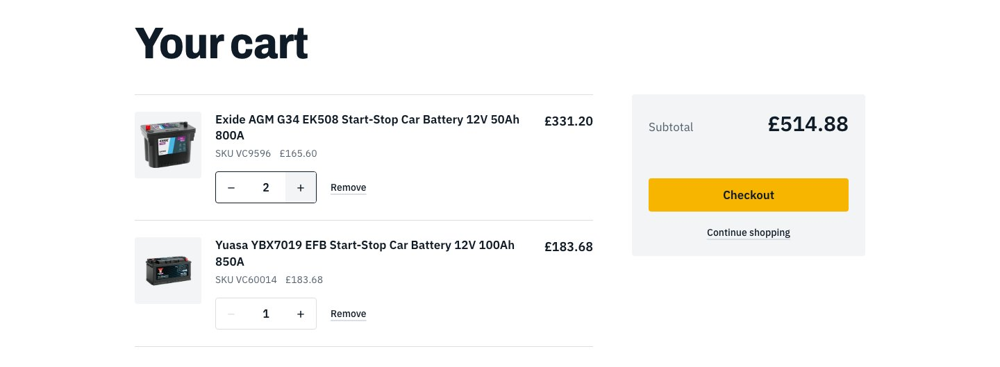
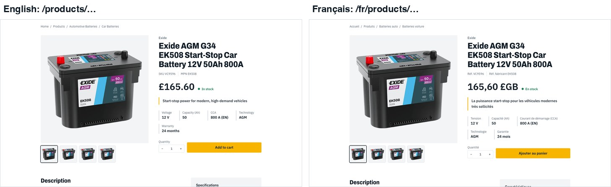
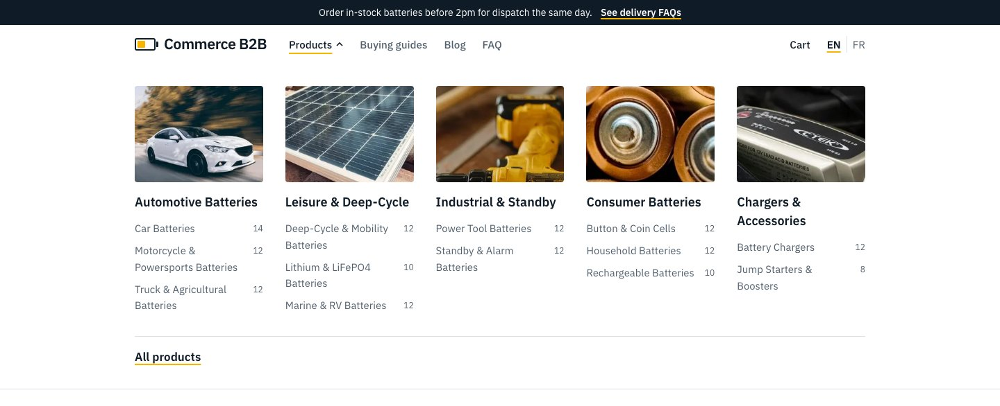
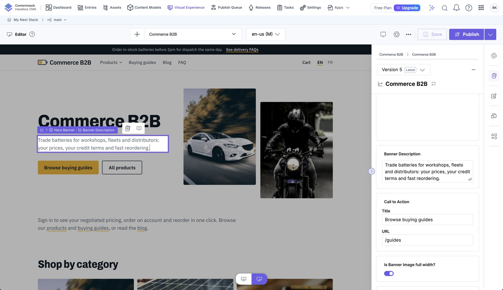

# Commerce B2B storefront

**Live:** https://contentstack-commerce-b2b.vercel.app (English) and https://contentstack-commerce-b2b.vercel.app/fr (French)

A headless B2B storefront for trade batteries. **Content** (pages, articles, guides, FAQs, navigation, banners) lives in
**Contentstack**; the **catalog, prices and cart** live in **BigCommerce**; **Next.js 16** (App Router) composes them.
The site is bilingual (English at `/`, French at `/fr`) and editors can edit it visually in Contentstack.

Pages and posts are **ordered lists of blocks** that editors can reorder in Visual Editor (a `page` entry has a `components` modular blocks
field, a post has `content` blocks). This is a single-CMS build: the UI, the content model (`core/`) and the Contentstack provider come
from the private switchable project `content-commerce-b2b`, reduced to Contentstack only (no switcher, no other CMS, no time travel).
**Status:** the block model is deployed (production and staging) and the earlier fixed-layout fields are pruned from the stack (7 October 2026).



```
  Contentstack (EU)               BigCommerce (headless channel)
  content, 2 locales              catalog, prices, cart, checkout
        │  Delivery SDK                   │  Storefront GraphQL
        └──────────────┐      ┌──────────┘
                       ▼      ▼
                 Next.js 16 storefront  ──►  Visitors (EN / FR)
                       ▲
        Live Preview + Visual Editor (editors)
```

## What is in it

| Area | What you get |
|---|---|
| **Home** | CMS-driven page made of blocks (hero with a staggered photo pair, intro, shop-by-category mosaic, value blocks, trade favourites, guides) in the order the editor chose |
| **Catalog** | Mega menu from the live category tree; listing and category pages with search-as-you-type, sort, and brand / technology / voltage / warranty / price filters; filters apply on click and show as removable chips |
| **Product page** | Gallery, price, stock, key specs, volume pricing, description, spec table, related guides and products, structured data |
| **Cart** | Add to cart, dynamic quantity stepper with instant totals, remove, hosted checkout hand-off |
| **Content** | Blog (36 articles, 6 authors), 6 buying guides, 15 FAQs, banners, announcement bar, navigation |
| **Languages** | English and French: routes, UI text, prices, dates and all Contentstack entries |
| **Editing** | Live Preview and Visual Editor: click-to-edit fields, and typing or reordering blocks re-renders the page from the draft |
| **Design** | "Workbench": light theme, 1100px pages, photography-led |

## Screenshots

<table>
<tr>
<td width="50%"><br><sub>Listing: search-as-you-type, removable filter chips, facets from BigCommerce</sub></td>
<td width="50%"><br><sub>Product page: gallery, price, stock, key specs, add to cart</sub></td>
</tr>
<tr>
<td><br><sub>Cart: instant quantity changes, saved to BigCommerce</sub></td>
<td><br><sub>The same page in English and French</sub></td>
</tr>
<tr>
<td><br><sub>Mega menu built from the live category tree</sub></td>
<td><br><sub>Buying guide with numbered steps and recommended products</sub></td>
</tr>
<tr>
<td><br><sub>Visual Editor: click a field on the page to edit it, the form stays in sync (screenshot of the earlier fixed-layout Home)</sub></td>
<td><br><sub>The ten content types in Contentstack (before the block model; the prune leaves eight)</sub></td>
</tr>
</table>

## Quick start

Requirements: Node 22+, Python 3.12+ with Pillow (only for the seeding scripts), a Contentstack stack and a BigCommerce
store with a storefront channel.

```bash
npm install
cp .env.example .env.local      # then fill in the values (see docs/operations.md)
npm run dev                     # http://localhost:3000   (French: /fr)
```

Common commands:

```bash
npm run dev          # development server (Turbopack)
npm run lint         # ESLint
npx tsc --noEmit     # type-check
npm run build        # production build

# Seed the stack with sample content (idempotent; needs CONTENTSTACK_MANAGEMENT_TOKEN)
python3 tools/contentstack/schemas.py      # content types
python3 tools/contentstack/seed.py         # authors, 36 posts, blog listing
python3 tools/contentstack/seed_extra.py   # FAQs, guides, spotlights, nav, banners, pages
python3 tools/contentstack/seed_fr.py      # French versions of everything
python3 tools/contentstack/blocks.py       # adds the block model on top (page.components, post content), both locales
python3 tools/contentstack/backup.py       # save content types and entries to .backups/ before a destructive change
python3 tools/contentstack/prune.py        # dry run: lists what the block model replaced (--run removes it; not run yet)
```

## Project layout

```
app/
  [locale]/                  every page lives under the locale segment
    layout.tsx               html lang, edit support, announcement bar, header (mega menu), footer
    page.tsx                 home (the Page with key `home`)
    [...slug]/page.tsx       any other Page by key: faq, guides, blog, or a page an editor adds (key -> `page` entry with url `/<key>`)
    blog/[slug]  guides/[slug]   article and guide detail pages
    products/                listing, and [...slug] for categories and product pages (translated roots rewritten onto it)
    cart/                    cart
  actions/cart.ts            server actions: add to cart, set quantity, remove
  globals.css                design tokens and base/component styles
proxy.ts                     locale routing (English rewritten to /en, French under /fr), translated catalog roots (x-catalog-root),
                             verified Live Preview parameters (trusted x-preview / x-cs-* headers), x-editor for requests framed by
                             Contentstack's app, frame-ancestors for Contentstack
core/
  content.ts                 the content model: Block, Page, Post, Guide, Faq, Spotlight, Navigation...
  edit.ts                    edit attributes (`$`) and the `tag(entity, field)` helper
providers/cms/
  contentstack/              client (Delivery SDK, preview stack, helpers), mapper (entries to the model), index,
                             live-preview (SDK init), edit-support
  gates.ts  meta.ts          preview gate (Live Preview parameters), frame-ancestors origins
components/                  UI building blocks: page-blocks (one view per block type), page-content, post-view, guide-view, hero, cards, mega menu, cart...
lib/
  content.ts                 facade the pages call (getPage, getPosts, getGuide...), reads through the Contentstack provider
  request.ts                 `isPreviewRequest()` and `inEditor()`: the proxy's trusted headers
  catalog-route.ts           translated catalog root (`x-catalog-root`) and redirects from another language's root
  bigcommerce.ts             Storefront GraphQL: products, categories, search, cart
  i18n.ts                    locales, URL helpers, UI strings, label maps
tools/contentstack/          content model, seeders, block model, backup, prune, workflow, French translations, photos
docs/                        documentation (start at docs/README.md)
HISTORY.md                   every request and its result
```

## Documentation

Start with **[docs/README.md](docs/README.md)**. Highlights:

- [Architecture](docs/architecture.md): how the pieces fit, routing, rendering and caching
- [Implementation details](docs/implementation.md): how each feature works
- [Contentstack](docs/contentstack.md): stack setup, the content types and the block model, publishing
- [Live Preview and Visual Editor](docs/live-preview-and-visual-editor.md): draft hash, the editor header, live sync and inline editing
- [BigCommerce](docs/bigcommerce.md): channel, token, queries, listing, cart
- [Internationalization](docs/i18n.md): locales, URLs, translation workflow
- [Editorial workflow](docs/workflow.md): staging site, approval stages, production publishing rule
- [Seeding](docs/seeding.md): sample content scripts, the block model, backup and the pending prune
- [Design system](docs/design-system.md): tokens, type, components
- [Operations](docs/operations.md): environment variables, deployment, troubleshooting
- [Decisions](docs/decisions.md): why things are the way they are

## Important notes

- **All sample content is fictional.** Author names, article text, FAQ policies, delivery claims and the
  `example.com` contact details are placeholders. Replace them before going public.
- **Product, category and custom-field text is translated by BigCommerce** (Store Translations) and read with the locale
  directive; URLs keep the English slugs. UI text, navigation and fallbacks live in `lib/i18n.ts`.
- The Contentstack stack is on the **free plan** (10 content types maximum; the prune freed two, so eight are in use).
- **The prune is done.** The earlier fixed-layout fields and the `blog_listing_page` and `hero_banner` types were removed after the block-model code was
  deployed; a backup of the stack before the prune is in `.backups/` (gitignored). See [docs/seeding.md](docs/seeding.md).
- Secrets live only in `.env.local` (gitignored). The management token is used by the seeding scripts, never by the
  running storefront.
