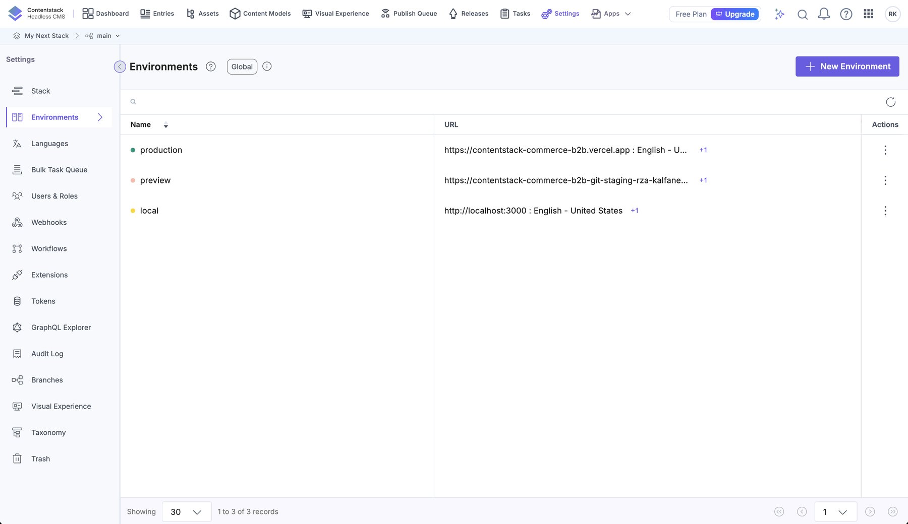
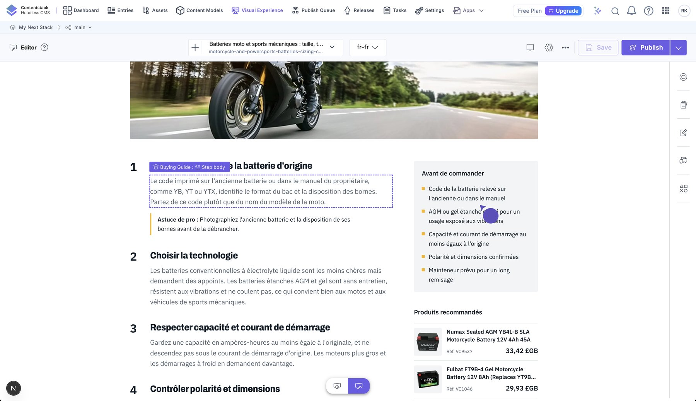

# Live Preview and Visual Editor

Goal: when an editor changes a field in the Contentstack entry form, the storefront preview updates without saving, and
elements on the page can be clicked to jump to the matching field (inline editing).

## How it works

```
Contentstack app ── entry form edits ──► draft stored under a "live preview hash"
        │
        └─ iframe: http://localhost:3000/<page>?live_preview=<hash>&content_type_uid=…&entry_uid=…&locale=…
                              │
        proxy.ts: verify the parameters, set trusted x-preview / x-cs-* headers
                              │
        Next.js (server) ◄────┘   getStack(preview): preview token + host eu-rest-preview.contentstack.com
                                  + stack.livePreviewQuery(params)  → entries read from the DRAFT
```

- **SSR mode** (`ssr: true`): after each edit the preview pane asks the site for fresh HTML; our Server Components read
  the draft through the preview host and render it. No client-side data fetching is needed.
- The **hash** in the URL identifies the draft session. `proxy.ts` checks for it (`previewGate` in `providers/cms/gates.ts`), removes any
  `x-preview` / `x-cs-*` header a client sent, and passes the hash and the entry being edited on as trusted `x-preview` and `x-cs-*` headers.
  `previewParams()` (`providers/cms/contentstack/client.ts`) reads them and `getStack(preview)` applies them with `livePreviewQuery()`.
- **The editor header.** The first request of the preview pane carries no hash yet, but the SDK must already be on that page to take over
  afterwards. `proxy.ts` therefore marks a request with `x-editor` when it has `live_preview` or is an iframe navigation whose `Referer` is
  Contentstack's app, and `components/edit-support.tsx` loads the SDK for `x-preview` or `x-editor` requests. A plain visitor gets neither.
- **Blocks.** Pages and posts are lists of blocks, so Visual Editor can reorder, add and remove them; each block's fields are tagged
  (`tag(block, "html")`) and the list itself is tagged on a wrapper (`tag(page, "components")`, `tag(post, "blocks")`).
- **Edit tags** (`data-cslp` attributes) mark which field each element shows. In **Visual Editor**, clicking an element
  opens its field; hovering shows an outline and a label (for example "Hero Banner : Banner Title").


*Visual Experience on the English home page: hovering shows the field ("Hero Banner : Banner Description"), clicking edits it inline, and the form on the right stays in sync.*

## One-time setup in Contentstack

1. **Settings → Live Preview**: enable it, choose the **`preview`** environment, and add the **preview token**.
2. Set the **Base URL for each locale** (this is the "base URL" needed for French):

   | Locale | Base URL (`local` environment) |
   |---|---|
   | English (en-us) | `http://localhost:3000` |
   | French (fr-fr) | `http://localhost:3000/fr` |

   In production use your real domain: `https://www.example.com` and `https://www.example.com/fr`.
3. Enable **Visual Experience / Visual Editor** for the stack and use the same base URLs.
4. For each content type with a URL (blog, guides) and for `page`, Live Preview resolves the entry from the page URL;
   our pages also declare their entry explicitly (see below).


*Settings → Environments lists each environment's Live Preview base URL per locale: `production` → the live site, `preview` → the staging site, `local` → localhost. Pick the environment in Visual Editor to edit against it ([workflow.md](workflow.md)).*

## Application setup

| Piece | File | What it does |
|---|---|---|
| Trusted headers | `proxy.ts`, `providers/cms/gates.ts` | verifies Live Preview's parameters, sets `x-preview`, `x-cs-*` and `x-editor` |
| Preview stack | `providers/cms/contentstack/client.ts` | `getStack(preview)`, `previewParams()`; preview host from `CONTENTSTACK_REGION` |
| SDK init | `providers/cms/contentstack/live-preview.tsx` | `ContentstackLivePreview.init({ ssr: true, mode: "builder", … })` once per page load |
| Loading it | `components/edit-support.tsx`, `lib/request.ts` | renders the SDK for `x-preview` or `x-editor` requests (`isPreviewRequest()`, `inEditor()`) |
| Edit tags | `client.ts → entries()`, `mapper.ts` | `addEditableTags(entry, contentType, true, locale)` adds `entry.$.<field>`; the mapper copies them into `$` of each block; `tag(entity, field)` in `core/edit.ts` |
| Embedding | `proxy.ts`, `providers/cms/meta.ts` | `Content-Security-Policy: frame-ancestors` for `*.contentstack.com` / `.io` (plus localhost in development) |

### Init options used

```ts
ContentstackLivePreview.init({
  ssr: true,                       // SSR: the page is re-requested after each edit
  enable: true,
  mode: "builder",                 // "Start Editing" opens Visual Editor
  stackDetails: { apiKey, environment },
  clientUrlParams: { protocol: "https", host: "eu-app.contentstack.com", port: 443 },
  editButton: { enable: true, position: "top-right" },
  editInVisualBuilderButton: { enable: true, position: "bottom-right" },
  overlayPropagation: { enable: true },   // our hero photos sit under a gradient overlay
});
```

### Page context

The site does not call `setPageContext()`, which posts a message to the Visual Builder and waits for an acknowledgement. When there is no builder
frame (for example in **Timeline mode**) the SDK logs *"Failed to send page context … The ACK was not received"*, which Next.js shows as an error
overlay. The earlier version declared the entry with `<meta name="contentstack:entry-uid">` tags; the current code renders none (the editor's URL
parameters name the entry), so verify entry resolution in Visual Editor when adding a page type.

### Edit tags

Tags are added **only in preview** (and the SDK itself is loaded only for preview requests and requests framed by Contentstack's app). Elements
opt in by spreading the tag object, which is `{}` when there is none:

```tsx
<h1 {...tag(hero, "title")}>{hero.title}</h1>
```

Fields tagged today:

| Page | Tagged fields |
|---|---|
| Pages (home, FAQ, guides, blog) | the list of components (reorder, add, remove); hero title, description, call to action, image and second image; text, image and video blocks; each feature's title / copy / image; collection titles, link and search labels, and the `items` list |
| Blog | post title, date, featured image, the list of content blocks and each block, author name and bio; card titles and images |
| Guides | title, summary, hero image, each step's title / body / pro tip (and the steps list), each checklist item (and the checklist); card titles and summaries |
| FAQ | question and answer |
| Spotlights | title and tagline |
| Site chrome | announcement message, header link labels, footer legal line |


*A French buying guide in Visual Editor: "Buying Guide : Step body" is outlined on hover, and the numbered steps, checklist and recommended products are real fields.*

Repeatable fields need two kinds of tag (found when the guide checklist could not be edited visually):

| Tag | Spread on | Effect |
|---|---|---|
| `entry.$.<field>__<index>` (for example `checklist__0`) | each item element | click-to-edit that single item |
| `entry.$.<field>__parent` (for example `checklist__parent`, `steps__parent`, `blocks__parent`) | the list container | lets the editor add, remove and reorder items |

Groups and modular blocks tag their sub-fields on the item itself (`step.$?.step_title`), as the steps do.

BigCommerce data (names, prices, images) is **not** editable here: it is edited in BigCommerce.

## Per-locale preview

Each locale has its own base URL, so editing the French entry opens `/fr/...` and reads `fr-fr` content. The locale comes
from the route (`/fr`), not from the query string.


*The French locale (`fr-fr`) in Visual Editor: the page at `/fr` loads, the language switcher shows FR, and the rich-text field is outlined ("Page : Rich Text").*

## Troubleshooting

| Symptom | Cause / fix |
|---|---|
| Preview shows published content, not edits | Preview token missing or wrong; `live_preview` param not reaching the page; base URL for that locale not set |
| 404 in the preview pane | The route does not exist for that URL, or the entry's `url` differs from the page path |
| `Encountered two children with the same key` | The preview API returned an entry twice; `entries()` in `client.ts` removes duplicates by uid (read lists through it) |
| Error 382 "tracker no longer exists" | A stale draft hash; `entries()` falls back to published content |
| The pane is blank or not editable on its first load | The SDK was not on that page: check `proxy.ts` sets `x-editor` (iframe `Sec-Fetch-Dest` and a Contentstack `Referer`) |
| `Failed to send page context … ACK` | Calling `setPageContext` outside Visual Builder; the site does not call it |
| Clicking an element does nothing | The element has no edit tag, the field is not tagged, or an overlay covers it (`overlayPropagation` is on) |
| "Refused to display … in a frame" | CSP / `X-Frame-Options`; the allowed ancestors are set by `proxy.ts` (`FRAME_ANCESTORS` in `providers/cms/meta.ts`; restart the dev server after changing them) |
| Edits are slow | In SSR mode every edit triggers a full server render; keep fetchers parallel (`Promise.all`) |

## Adding editing support to a new page or field

1. Read through `entries(...)` in `client.ts` (it adds the edit tags in preview).
2. In `mapper.ts`, copy the tags into the model with `t(entry, { field: "field_uid" })` (the map renames the model's field to the field uid).
3. Spread `tag(entity, "field")` on the element that displays it; for repeated groups use the item's own `$`.
4. Add the field to the table above.
